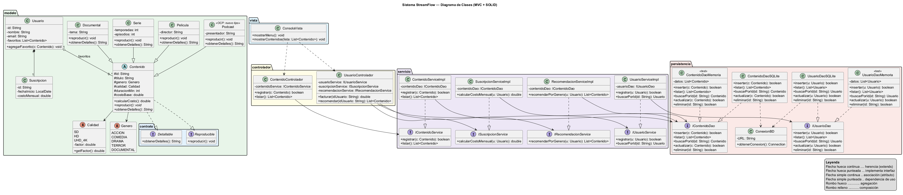

# StreamFlow — Informe del Proyecto Bimestral

**Universidad Técnica Particular de Loja**
Programación Orientada a Objetos — Segundo Bimestre
**Autor:** Pablo Ochoa y Pedro Gomez
**Fecha:** 
**Repositorio:** https://github.com/PabloOchoa-maker/ProyectoBimestral2B

> **Cómo usar este documento**
> Se escribe **en paralelo al código**, no la noche antes de entregar.
> El grueso del análisis SOLID sale de `decisiones.md`, donde cada decisión ya quedó
> registrada con su porqué mientras estaba fresca.
> Al terminar, se exporta a PDF.
> _(Eliminar este bloque en la versión final.)_

---

## 1. Introducción

_(Qué es StreamFlow y qué problema resuelve. Breve.)_

StreamFlow es un sistema de gestión de una plataforma de contenidos por streaming. Permite administrar un catálogo de contenidos (películas, series, documentales y podcasts) y gestionar las suscripciones de los usuarios, cuyo costo mensual depende de la calidad contratada. Además, ofrece recomendaciones a cada usuario según los géneros de sus contenidos favoritos.

## 2. Requisitos del sistema

_(Listar los requisitos funcionales que pidió el enunciado. Marcar cuáles se cumplieron.)_

- Catálogo de contenidos con distintos tipos.
- Cálculo del costo mensual de suscripción en función de la calidad (SD / HD / UHD_4K).
- Recomendación de contenidos por género.
- Persistencia en base de datos SQLite.
- _(completar con el resto del enunciado)_

## 3. Arquitectura y diseño

### 3.1 Arquitectura por capas (MVC)

El sistema se organiza en capas, con una regla estricta: **cada capa habla únicamente con la de abajo.**

```
Vista → Controlador → Servicio → DAO → Base de datos
```

| Capa | Responsabilidad |
|---|---|
| `vista` | Interacción con el usuario por consola. No contiene lógica. |
| `controlador` | Traduce entre la vista y el negocio. No conoce la persistencia. |
| `servicio` | Reglas de negocio: cálculo de costos, recomendaciones, validaciones. |
| `persistencia` | Traduce entre objetos Java y filas de la base. No conoce el negocio. |
| `modelo` | Entidades del dominio y sus contratos. |

### 3.2 Diagrama de clases



_(Fuente PlantUML versionado en `docs/uml/streamflow_uml.puml`)_

### 3.3 El patrón DAO

_(Explicar: interfaz + implementación. Por qué los servicios declaran `IContenidoDao` y no
`ContenidoDaoSQLite`. Mencionar `ConexionBD` como único punto que conoce la URL de la base.
Base: entrada del 2026-07-13 en `decisiones.md`.)_

### 3.4 Decisión de diseño corregida: el controlador no toca la persistencia

_(Contar el problema real: en la primera versión del UML los controladores tenían un DAO
como atributo y se saltaban la capa de servicio. Explicar por qué se corrigió y qué se añadió.
Esta sección vale mucho: demuestra criterio propio, no un diagrama que salió bien de casualidad.
Base: entrada del 2026-07-13 en `decisiones.md`.)_

## 4. Análisis SOLID

> Para cada principio: **una clase concreta del proyecto**, qué hace, y por qué cumple el principio.
> Evitar definiciones de libro sin ejemplo — lo que se evalúa es que se vea aplicado en el código propio.

### 4.1 SRP — Responsabilidad única

_(Candidatos: la separación `ContenidoServiceImpl` (reglas) vs `ContenidoDaoSQLite` (persistencia).
Contrastar con el antipatrón del controlador que hacía las dos cosas.)_

### 4.2 OCP — Abierto/cerrado

_(Candidatos: `Podcast` — se añadió un tipo de contenido nuevo sin tocar `Contenido` ni el resto
del sistema. También el enum `Calidad`: agregar una calidad nueva no obliga a modificar
`calcularCosto()`.)_

### 4.3 LSP — Sustitución de Liskov

_(Candidato: cualquier subclase de `Contenido` funciona donde se espera un `Contenido`;
`ConsolaVista.mostrarContenidos(List<Contenido>)` los trata a todos igual.
También: `ContenidoDaoMemoria` sustituye a `ContenidoDaoSQLite` sin que el servicio se entere.)_

### 4.4 ISP — Segregación de interfaces

_(Candidatos: `Detallable` y `Reproducible` son interfaces pequeñas y separadas, en vez de una
interfaz gorda que obligue a implementar métodos que no se usan. Igual los servicios:
`ISuscripcionService` e `IRecomendacionService` están separados por responsabilidad.)_

### 4.5 DIP — Inversión de dependencias

_(Candidato principal, el más fuerte del proyecto: los servicios declaran `IContenidoDao`,
nunca `ContenidoDaoSQLite`. La clase concreta solo se elige en `Main`, al arrancar.
Señalar la flecha correspondiente en el UML.)_

## 5. Persistencia

_(Esquema de la base de datos. Cómo se resolvió el mapeo de la jerarquía `Contenido` a tabla SQL
— el desajuste entre herencia y tablas planas. Decisión pendiente: ver `decisiones.md`.)_

## 6. Pruebas unitarias (JUnit 5)

_(Qué se probó y por qué. El punto clave a destacar: gracias al patrón DAO, los tests inyectan
`ContenidoDaoMemoria` en los servicios y prueban la lógica de negocio **sin base de datos**,
lo que los hace rápidos, repetibles y aislados.)_

**Casos de prueba:**

| Test | Qué verifica | Resultado |
|---|---|---|
| _(completar)_ | | |

**Evidencia de ejecución:**

_(Captura de los tests en verde.)_

## 7. Conclusiones

_(Escribir al final, con el trabajo hecho. Qué se aprendió, qué se haría distinto.)_

## 8. Referencias

_(Bibliografía y fuentes consultadas.)_


## PSTD: Al no tener una base como informe, generamos la base de ello con inteligencia artifical.
